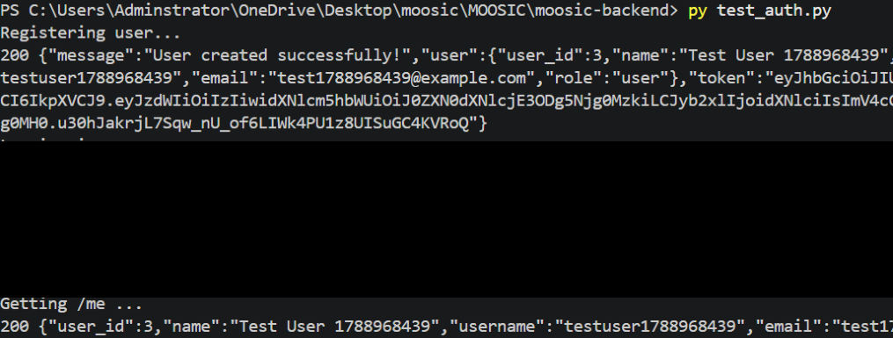
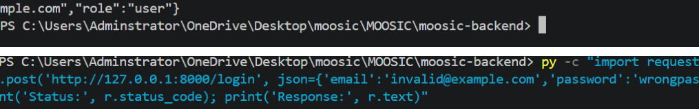
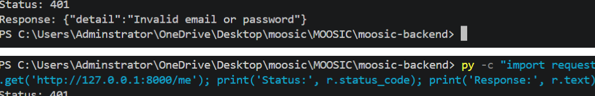
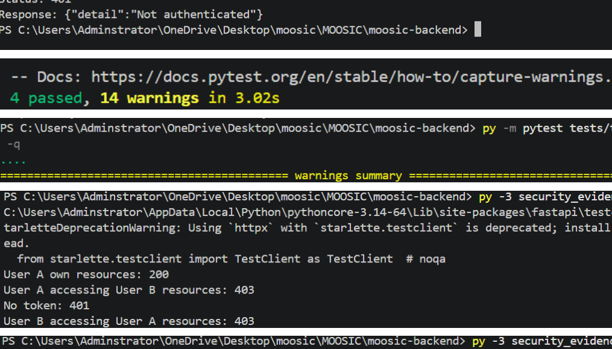
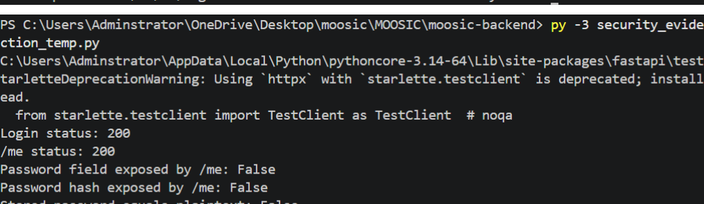
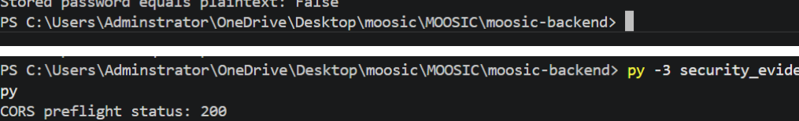
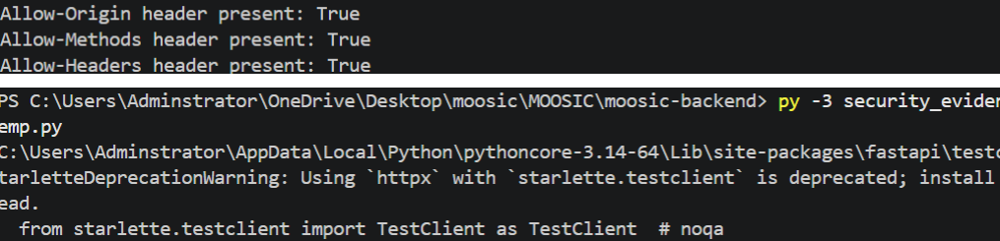
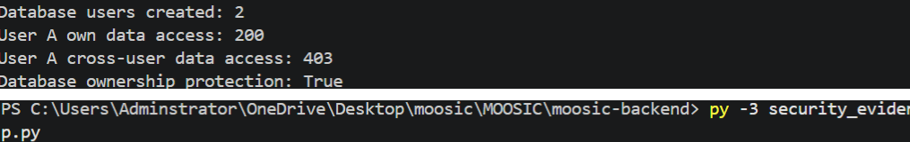
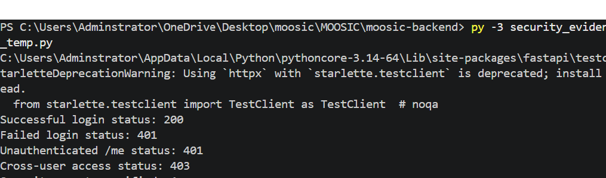
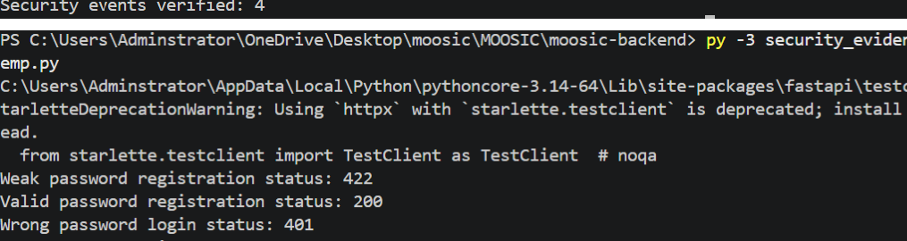

[SECURITY_TESTING_EVIDENCE.md](https://github.com/user-attachments/files/32020020/SECURITY_TESTING_EVIDENCE.md)
# Moosic – Security Testing Evidence

This document provides screenshot evidence for the **8 security components** implemented and tested for the Moosic digital business system.

The screenshots were compiled from the security testing evidence document submitted during development. Each section states what was tested and the observed result.

> **Security note:** Authentication screenshots were redacted to avoid exposing JWT access tokens. No passwords, registration codes, or usable credentials are included in this evidence package.

---

## 1. Authentication

**Security mechanism:** User registration, email/password login, JWT authentication, and protected `/me` endpoint.

**Evidence:**
- Successful registration: HTTP `200`
- Successful login: HTTP `200`
- Protected `/me` request: HTTP `200`
- Invalid credentials: HTTP `401`
- Unauthenticated `/me` request: HTTP `401`

**Result:** Authentication and protected endpoint access were successfully tested.

---

## 2. Authorization

**Security mechanism:** Role-based authorization and user-ownership checks.

**Evidence:**
- User A accessing own resources: `200`
- User A accessing User B's resources: `403`
- No authentication token: `401`
- User B accessing User A's resources: `403`
- Manager accessing manager-only endpoint: `200`
- Normal user accessing manager-only endpoint: `403`

**Result:** Users can access their own protected resources, cross-user access is denied, and manager-only access is restricted by role.

---

## 3. Data Protection

**Security mechanism:** Password hashing and protection of password information from API responses.

**Evidence:**
- Login status: `200`
- `/me` status: `200`
- Password field exposed by `/me`: `False`
- Password hash exposed by `/me`: `False`
- Stored password equals plaintext: `False`

**Result:** Passwords are not stored as plaintext and sensitive password information is not returned by the `/me` endpoint.

---

## 4. Network Security

**Security mechanism:** CORS configuration for controlled browser-origin access.

**Evidence:**
- CORS preflight status: `200`
- `Allow-Origin` header present: `True`
- `Allow-Methods` header present: `True`
- `Allow-Headers` header present: `True`

**Result:** The configured CORS policy responds correctly to a preflight request.

> The project's firewall/network-level control is maintained separately as a team member's assigned security component; this screenshot documents the CORS portion tested here.

---

## 5. Database Security

**Security mechanism:** Authenticated ownership protection for user-specific database resources.

**Evidence:**
- Database users created: `2`
- User A own data access: `200`
- User A cross-user data access: `403`
- Database ownership protection: `True`

**Result:** User-specific database resources are protected through authenticated ownership checks.

---

## 6. Backup and Recovery

**Security mechanism:** SQLite backup, failure simulation, restoration, and record recovery.

**Evidence:**
- Backup created: `True`
- Database failure simulated: `True`
- Database restored: `True`
- Recovered test record: `True`
- Recovery test: `PASS`

**Result:** The backup and recovery test successfully restored the test database and recovered its record.

---

## 7. Monitoring and Logging

**Security mechanism:** Security-relevant HTTP events are observable through application/access logging and verified using status-code tests.

**Evidence:**
- Successful login status: `200`
- Failed login status: `401`
- Unauthenticated `/me` status: `401`
- Cross-user access status: `403`
- Security events verified: `4`

**Result:** Successful, failed, unauthenticated, and unauthorized access events were verified using their expected HTTP status codes.

---

## 8. Account and Password Protection

**Security mechanism:** Minimum password length and rejection of incorrect credentials.

**Evidence:**
- Weak password registration status: `422`
- Valid password registration status: `200`
- Wrong password login status: `401`
- Password protection test: `PASS`

**Result:** Weak passwords are rejected, valid passwords are accepted, and incorrect passwords cannot authenticate.

---

## Overall Security Testing Result

All **8 required security components** were tested with successful expected results:

| # | Security Component | Test Result |
|---|---|---|
| 1 | Authentication | PASS |
| 2 | Authorization | PASS |
| 3 | Data Protection | PASS |
| 4 | Network Security (CORS) | PASS |
| 5 | Database Security | PASS |
| 6 | Backup & Recovery | PASS |
| 7 | Monitoring & Logging | PASS |
| 8 | Account & Password Protection | PASS |

These screenshots are intended as supporting evidence for the Moosic project's security implementation and testing.

